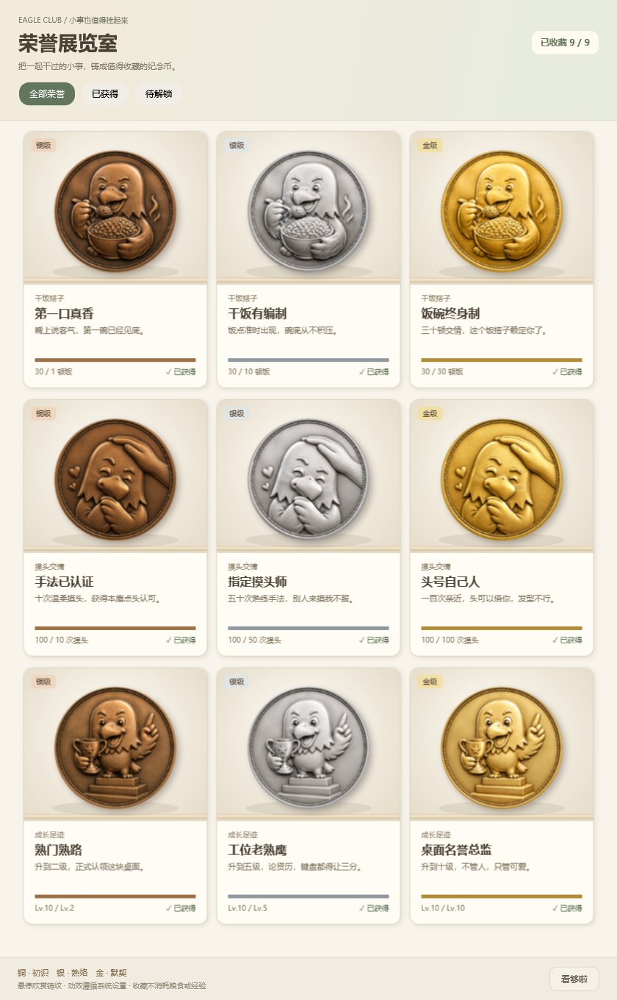

<div align="center">

# EagleDeskPet · 大头鹰桌宠

一只陪你上班、摸头会害羞、饿了要干饭，还能替 AI 和 GitHub 传话的桌面小鹰。

**Windows x64 · C# / WPF · v1.9.0 Demo · 最高 60 Hz 动画时间轴**

v1.9 Demo 功能已实现：最新真实应用联调 **9/9 通过**，三套形象、四张桌子和四种电脑的 48 种工作组合已复查。见 [本版更新](docs/RELEASE-NOTES-v1.9.md) / [验证与未测边界](docs/VALIDATION-v1.9.md)；不把短时窗口采样当作每台电脑的物理 60 FPS 保证。

[快速上手](docs/QUICK-START.md) · [AI 一键接入](docs/AI-AUTO-SETUP.md) · [GitHub 通知](docs/GITHUB-NOTIFICATIONS.md) · [MCP 文档](docs/MCP.md) · [需求与路线图](docs/REQUIREMENTS.md)


*工位入场 → 持续办公 → 忙碌上头 → 收工。上图是历史 v1.8 的 20 FPS 演示 GIF，不代表新外观验收或程序的实际帧率。*


*本版实际窗口：摸鱼卫衣 + 电竞工位。截图来自隔离测试，不含桌面或私人内容。*

</div>

## 它能做什么

| 功能 | 小鹰的日常 |
| --- | --- |
| 桌面陪伴 | 透明背景、保持置顶、按住拖动、调整大小；待机时站立和打哈欠 |
| 摸头与喂饭 | 全身害羞、捧碗干饭；一碗完整吃完再续，开工 / 暂停不吞掉排队的饭；三摸护头，不额外刷奖励 |
| 挂机养成 | 积累粮食、饱食度、心情、经验和等级；没有死亡惩罚 |
| 工作赚钱 | 持续办公、满 30 分钟忙碌；每有效工作分钟 +1 经验和 +1 鹰币，本次启动收入单独显示 |
| 鹰币小卖部 | 预览、购买、收藏动作和桌子 / 电脑 / 整套服装；装备等安全收场后生效 |
| 自主情绪 | 默认关闭；饿了抱空碗，心情低时闹别扭；场景有进入、循环、退出和冷却 |
| 猜拳小游戏 | 宠物先选拳，完整出招后揭晓；无下注，最多每 5 分钟心情 +2 |
| 职场碎碎念 | 60 条普通短句 + 16 条情境短句，按工作、饥饿、低心情等选择，每分钟最多一句，可关闭 |
| 荣誉展览馆 | 9 枚金银铜浮雕徽章；10 顿饭解锁薄荷桌，2 级解锁喝茶，和商店共享拥有记录 |
| AI 传话 | 可选 MCP 通知桥；一键配置本机 Codex、Claude Code、CodeBuddy Code 的结束提醒 |
| GitHub 消息 | 可选连接通知收件箱，提醒提及、请求评审、指派等动态，点击返回 PR / Issue |
| 任务小信使 | 按来源和任务更新、去重、未读和静音；只有来源明确报告才显示成功或失败 |

不接 AI、不连接 GitHub，也可以独立养宠物。普通养成和碎碎念不需要账号、API Key 或联网。

<details>
<summary>看看荣誉展览馆</summary>

<p align="center">

</p>

截图使用测试进度展示全部徽章，实际需要达到对应条件后解锁。

</details>

## 开始使用

当前仓库提供完整源码和动画资源，**源码 ZIP 不是可直接运行的程序包**。可以按下方步骤构建；如果拿到已打包的程序，解压后运行 `EagleDeskPet.exe` 即可，无需安装 .NET。

`EagleDeskPet.Mcp.exe` 是可选 AI 桥接器，使用 AI 功能时与主程序放在同一目录，**不要直接双击它**。升级前先从旧版右键菜单退出。

| 操作 | 效果 |
| --- | --- |
| 按住左键拖动 | 移动小鹰，保存位置 |
| 单击 / 右键“摸摸头” | 温柔摸头害羞，短时连续摸头会抗议 |
| 右键“我的饭搭子” | 查看养成状态、喂饭和设置 |
| 右键“开始工作 / 取消工作” | 入场办公 / 完整收工 |
| 右键“鹰币小卖部 · 我的收藏” | 独立预览、购买、装备；预览不扣钱、不改变宠物 |
| 右键“石头剪刀布” | 开一局约 10 秒的小游戏；先收工再玩 |
| 右键“自主情绪小剧场” | 开关自动情绪；“预览空碗小剧场…”为独立只读预览 |
| 双击 | 有可返回的 AI 通知时打开配置的应用，否则打开养成面板 |
| 右键菜单 | 调整大小、置顶、暂停、显示帧率、开关碎碎念、查看荣誉与消息 |

初始有 5 份饭，每挂机 5 分钟积累 1 份，上限 99 份。每完整有效工作分钟额外获得 1 经验和 1 鹰币，余额上限 999999；每小时消耗 12 饱食度、10 心情，连续工作 30 分钟进入忙碌。取消工作或饱食度到 0 后停止计薪并收工；退场动画不续发工资。

当前目录包含桌子 4 款、电脑 4 款、服装 3 套和 1 个动作（含免费默认项），非默认内容如下。商品必须通过资源完整性检查才可购买，“目录里有名字”不等于缺帧也能上架。

| 商品 | 鹰币 | 另一种获得方式 |
| --- | ---: | --- |
| 薄荷小工位 | 20 | 累计吃 10 顿饭 |
| 午夜小电脑 | 30 | 无 |
| 喝茶缓一缓 | 15 | 达到 2 级 |
| 认真上班装 | 40 | 无 |
| 暖木复古桌 | 25 | 无 |
| 闪电电竞桌 | 35 | 无 |
| 奶油复古电脑 | 25 | 无 |
| 闪电小电脑 | 35 | 无 |
| 摸鱼卫衣 | 45 | 无 |

买到后永久拥有；预览、重复播放和重复装备不收费、不额外发奖。荣誉和购买走同一份拥有记录，不能重复扣款。

进度自动保存在本机，离线或长时间挂起最多补算 2 小时，在饥饿耗尽处截断；v1.8 旧档升级不追发历史工资。“本次启动已赚”包括本次启动补算的工资，不因购物减少，不是钱包余额。关闭程序不等于取消工作，想结束这轮工作请先点“取消工作”。详细规则见[快速上手](docs/QUICK-START.md)。

## 从源码构建

需要 **Windows x64、Git 和 .NET 8 SDK**。运行时动画帧已随仓库提供，构建 EXE 不需要 Python、图像生成服务或 RIFE。

```powershell
git clone https://github.com/ouchihao/EagleDeskPet.git
cd EagleDeskPet
.\publish.ps1
```

如果系统对本地脚本有执行限制，请按你的设备或组织策略允许运行该脚本。也可以不运行脚本，直接执行：

```powershell
dotnet publish .\DuckDeskPet\DuckDeskPet.csproj -c Release -p:PublishProfile=win-x64 -o .\dist\v1.9.0
dotnet publish .\EagleDeskPet.Mcp\EagleDeskPet.Mcp.csproj -c Release -r win-x64 --self-contained true -p:PublishSingleFile=true -p:EnableCompressionInSingleFile=true -p:IncludeNativeLibrariesForSelfExtract=true -o .\dist\v1.9.0
Copy-Item -LiteralPath .\docs\THIRD-PARTY-NOTICES.md -Destination .\dist\v1.9.0\THIRD-PARTY-NOTICES.md
```

脚本从主工程版本读取默认输出目录，本版为 `dist/v1.9.0/`；它拒绝非空目标，不删除或覆盖旧包，需要重发时指定新的 `-OutputDirectory`。手动发布也请先选择新的空目录。分发时将两个自包含 EXE 与 `THIRD-PARTY-NOTICES.md` 一起保留；脚本自动复制依赖声明，手动发布需执行上面的复制步骤。首次构建需要还原 NuGet 依赖。源码包含较多逐帧 PNG，因此克隆和发布产物都比纯代码项目大；构建缓存、EXE、存档和凭据不纳入 Git。

## 让它替 AI 和 GitHub 传话

### AI：MCP + 结束事件

右键小鹰 → **AI 自动传话 · 一键接入** → 选择客户端 → 预览路径 → 点击接入。安装器会先备份再合并自己的配置，保留其他 MCP / Hook；也可移除本安装器添加的条目。

- 支持本机 Windows 的 Codex、Claude Code、CodeBuddy Code 配置，不是给本地模型安装插件，也不是监听所有 AI 聊天窗口。
- MCP 提供 `pet_notify` 和 `pet_get_state`；自动新回复提醒通过客户端的 Stop 命令 Hook 发送同一类本地通知，不依赖模型每次主动调用工具。
- 客户端仍需审核 Hook / MCP 信任并开启新会话；Claude Code、CodeBuddy Code 的 Windows Hook 需要 Git Bash。
- 通知只弹小气泡，不会打断工作动画；返回入口打开用户配置的应用，不保证定位到精确会话。
- `Stop` 仅表示“回复就绪”，不代表任务成功。完整任务列表需要来源另外发送 `taskId`、递增 `revision` 和明确状态；GitHub 评审通知不会被猜成 CI 成败。

已有手动 Hook、自定义配置目录、组织策略等情况见[一键接入指南](docs/AI-AUTO-SETUP.md)。其他支持 MCP 的客户端可参考[手动配置与协议](docs/MCP.md)。

### GitHub：直接读取通知接口

右键小鹰 → **GitHub 消息**，在本机填写带 `notifications` 范围的 **classic PAT** 并验证连接。不需要 GitHub MCP，也不索取 GitHub 密码。

约每 60 秒检查一次，并遵守服务器轮询要求和限流；这不是实时推送。首次连接安静导入已有未读，后续更新才提醒。“本地全部看过”不会修改 GitHub 的已读状态。

Token 仅在应用中填写，**不要放进代码、Issue 或聊天记录**。设置、通知筛选和权限边界见 [GitHub 通知指南](docs/GITHUB-NOTIFICATIONS.md)。

## 动画是怎么做的

角色不是把半身表情包直接贴到桌面，也不是用整图翻转或交叉淡化来换动作：

1. 根据角色参考生成全身关键姿势，保持脸型、配色和动作语义。
2. 使用 RIFE 光流插帧，再做透明边缘处理、脚点对齐与时序检查。
3. 导出连续 RGBA PNG，角色与桌子、电脑、火焰分层。
4. 在完整动作端点衔接；工作场景拥有独立的入场、循环、转忙和退场阶段。

哈欠、害羞、干饭每段 2 秒、121 个含首尾端点的采样帧；工位入场为 3.5 秒。普通眼睛转为忙碌黄眼时，经过闭眼再睁眼的关键姿势，不直接混合两套眼睛。

WPF 跟随桌面合成器，以最高 60 Hz 时间轴选帧，图片预解码后播放。**60 Hz 素材与调度不等于所有电脑恒定 60 FPS**；显示器刷新率、系统负载、远程桌面等都会影响实际表现。

v1.9 新增 10 段默认形象动画、1150 张运行帧；办公服和摸鱼卫衣各覆盖 19 段、2299 张帧和独立站姿，不是往鹰身上贴静态衣服。三套当前形象共 6900 张运行 PNG 已完整解码验证；桌子与电脑独立搭配。按需预载会占用显著内存，资源与验证边界见 [v1.9 素材说明](docs/ASSETS-v1.9.md)。

[工作动画制作说明](docs/WORK-ANIMATION-ASSETS.md) · [v1.9 新动作提示词](DuckDeskPet/Assets/AnimationSources/expansion-v1-prompts.md) · [九枚徽章提示词](docs/BADGE-ASSETS-v2.md)

## 项目结构与测试

```text
DuckDeskPet/          WPF 窗口、互动界面、GitHub、客户端接入与动画资源
DuckDeskPet.Core/     养成规则、动作调度和通知逻辑
DuckDeskPet.SelfTest/ 核心逻辑自测
EagleDeskPet.Mcp/     MCP stdio 服务与一次性 Hook 通知入口
tools/               动画制作、资源检查和隔离集成测试
References/          原始 GIF 参考说明（原图仅在本机保留，不入 Git）
docs/                使用文档、制作说明和版本验证记录
publish.ps1          Windows x64 自包含发布脚本
```

`DuckDeskPet` 是早期保留的内部目录/命名空间；对外程序名统一为 `EagleDeskPet`。动作清单在 [actions.json](DuckDeskPet/Assets/actions.json)，旧白眼、炸弹等资源保留用于开发参考，不在当前待机动作池中。

在仓库根目录运行基础自测：

```powershell
dotnet run --project .\DuckDeskPet.SelfTest\DuckDeskPet.SelfTest.csproj -c Release
dotnet run --project .\tools\WorkStageSelfTest\WorkStageSelfTest.csproj -c Release
dotnet run --project .\tools\HonorSelfTest\HonorSelfTest.csproj -c Release
```

更多测试入口与适用范围见[开发与测试](docs/DEVELOPMENT.md)。当前结果见 [v1.9 验证记录](docs/VALIDATION-v1.9.md)，[v1.8 验证记录](docs/VALIDATION-v1.8.md)仅作历史基线；模拟事件和自动化测试不代表已验证每种客户端版本、真实账号消息或长时间物理屏幕帧率。

## 数据与隐私

- 养成和设置存于 `%LOCALAPPDATA%\EagleDeskPet`，没有账号体系或云端养成存档。
- GitHub Token 使用当前 Windows 用户的 DPAPI 加密保存；通知标题、仓库名则保存在本地明文缓存中，最多 200 条，断开时可清除。
- MCP 使用当前 Windows 用户的本地命名管道，不开放网络端口、不读取聊天记录。任务正文和任务状态仅保留本次进程内存，不写入存档或 `pet_get_state`；自动 Hook 另保存用于去重的哈希文件名和随机轮次标识。
- AI 配置备份可能包含原配置里的密钥，不要分享备份、整个用户数据目录或客户端配置。
- 尚未实现任意角色包、好友联机、真实付费、更多职业或“专属下班仪式”；不要将需求池里的后续想法当作已提供功能。

## 素材与贡献

新想法、优先顺序和验收标准持续记录在[需求与路线图](docs/REQUIREMENTS.md)。REQ-001～008 的 Demo 功能已实现，验收框按实际证据更新，跨 DPI、人工拖动和长期性能仍单列未测；后续 IDEA 保留备选或远期状态，不随这次代码更新自动变成已实现。

欢迎通过 [Issues](https://github.com/ouchihao/EagleDeskPet/issues/new/choose) 反馈问题或提出动作创意；新手可直接填写“功能建议”或“缺陷报告”表单。如何补需求、拆任务和提交改动见[参与指南](CONTRIBUTING.md)。报告动画问题时，附动作名称、版本、截图或短录屏会更容易定位；请先隐藏通知里的私人内容。

代码、AI 生成资源和原始表情包参考不是同一种授权对象。原始角色与表情包版权归相应权利人；原始 GIF 及其拼图仅在本机保留，不随 Git 仓库分发。公开代码和生成资源不代表授予原角色素材的商用许可，本仓库暂未指定统一的开源许可证。第三方库说明见 [THIRD-PARTY-NOTICES](docs/THIRD-PARTY-NOTICES.md)，参考素材见 [References](References/README.md)。
