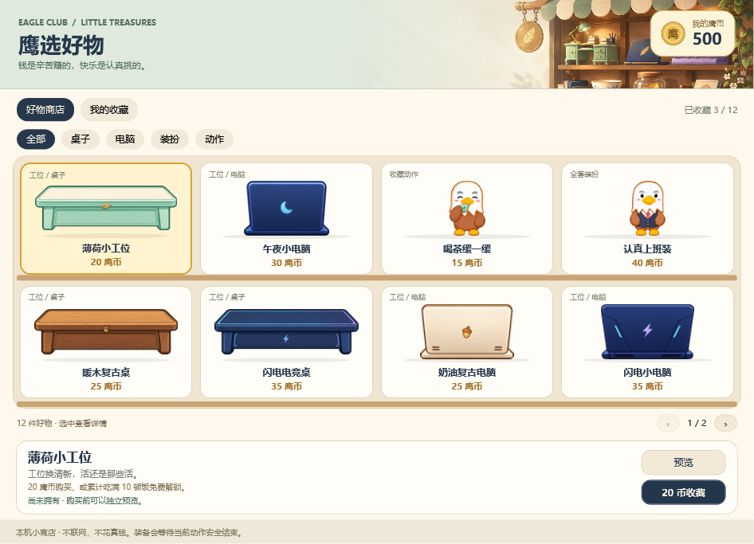

# 大头鹰 v1.11 · 快速上手

v1.11 增加有实际属性的装备、精确到分的工资、递增等级与荣誉门槛，以及本地定时提醒。价格、加成、成长周期和旧档迁移统一见[经济规则](ECONOMY-v1.11.md)。保留俱乐部界面、紧凑猜拳和 18 枚荣誉；历史[界面验证](VALIDATION-v1.10.md)和[猜拳验证](RPS-ANIMATION-v1.10.1.md)不等于本版全部素材的验收。

## 启动与基础操作

先从右键菜单退出旧版，再运行已解压程序包里的 `EagleDeskPet.exe`。自包含发布包不需要另装 .NET；源码 ZIP 不能直接双击运行，需按 [README](../README.md) 构建。默认发布目录为 `dist/v1.11.0`。首次启动需要预载资源，稍等片刻；实际装备就位后才补算离线收入，不会先按未验证的装备发钱。

- 按住左键拖动小鹰；右键调整大小、置顶、暂停和帧率显示。
- 单击或点“摸摸头”会害羞；10 秒内第三次摸头改为护头龇牙。连摸不绕过有效摸头的奖励冷却。
- “我的饭搭子…”打开俱乐部面板；没有可返回的通知时，双击也打开面板。“日常陪伴”管喂饭和互动，“工位与钱包”看上工与收入，“消息与设置”集中管理传话和开关。
- 初始 5 份饭，每挂机 5 分钟增加 1 份，上限 99。点“开饭啦”，或把饭拖到小鹰身上。满腹、缺粮和冷却时不扣粮。
- 一份饭从排队到真正干饭结束期间不能再扣第二份，也不能被开工、暂停、猜拳或换装抢走；退出时会先吃完这一口。动作队列放不下时先拒绝，不扣粮。
- 默认待机仍只有站立和哈欠。普通动作完整结束后站立 2 秒；新动作不会因为购买而自动塞进待机池。

窗口打开、面板切页有约 180 ms 的轻过渡；商店换页和猜拳提示也有短动效。关闭 Windows 客户区动画或使用高对比度时不播放这些界面动效。它们与小鹰的逐帧动画分开，不用淡入淡出替代角色的收手、闭嘴或收工。

## 工作、鹰币与收入

点“开始工作”，预载完成后桌子滑入、电脑落桌，持续办公；连续工作 30 分钟转为忙碌。点“取消工作”，或饱食度到 0，立即停止累计工作收益，再完整收起工位。

| 规则 | 当前 Demo 数值 |
| --- | --- |
| 基础工作收益 | 每有效工作分钟 +1 经验、+1.00 鹰币；装备分别增加工作经验和工资效率 |
| 钱包 | 初始 0.00，上限 999,999.00；逐分入账，不足 0.01 的余数保留；不能充值或兑换 |
| 基础工作消耗 | 每小时饱食度 -12、心情 -10；生效装备最多各减免 50% |
| 装备加成 | 三槽相加而非连乘；工资最高 +250%、工作经验最高 +200%，只算已拥有且真正生效的装备 |
| 忙碌 | 连续工作 30 分钟；不增加收益倍率 |
| 离线 / 挂起 | 最多补算 2 小时，在饥饿耗尽处截断，不和在线结算重复 |
| 收工动画 | 不继续发工资；预载等待、加载失败、被拒绝开工也不计薪 |

面板区分“余额”和“本次启动已赚”：后者包含启动时补算的工资，不因购物减少，重新打开程序后重新累计本次统计。隐藏、锁屏或渲染速度不作为计薪依据；工资保存时间高水位，回拨后不重复领取同一区间。金额显示两位小数，工作经验的不足整数部分也保留；换装先按旧属性结算，不用新倍率放大以前的半分钟。

升级到版本 3 存档时，旧等级与级内百分比一次性映射到新曲线，不掉级，重启不重复换算；旧余额、交易记录、收藏与已得徽章保留，不追发历史累计工资。现在升级所需经验逐级增加，例如 2 / 10 / 25 级累计需要 100 / 2,700 / 16,200 XP，面板显示本级进度和距升级经验，不再每 100 XP 固定升一级。

工作期间先收工再喂饭、摸头、喝茶或猜拳；取消后等待完整退场。关闭程序不等于取消工作，保存的工作状态可能在下次启动时继续。

## 小卖部、收藏与荣誉奖励

右键“鹰币小卖部 · 我的收藏…”打开“鹰选好物”。正常窗口是 4 列 × 2 排的商品货架，每格都有真实商品图；窄窗减少列数、矮窗减少排数，用翻页继续浏览，不需要一路向下滚。

先选“全部 / 桌子 / 电脑 / 装扮 / 动作”，也可切到“我的收藏”，再点商品格。下方详情显示价格、属性、替换差异、获得条件、已收藏 / 使用中 / 待生效状态；支持方向键选商品、Page Up / Page Down 翻页。先独立预览，喜欢再购买；预览舞台不改变桌宠、余额、拥有权或奖励，也不提供收益加成。

购买前弹出俱乐部风格确认小窗，展示真实商品图、明确价格和购买前后余额。点“确认收藏”才尝试扣款；“先等等”、关闭或 Esc 都是取消。初始键盘焦点在“先等等”，Tab 切到确认后可按 Enter。买到后另点装备或播放，不会自动替换当前形象。

| 类别 | 付费档位 | 价格区间 | 说明 |
| --- | ---: | ---: | --- |
| 电脑 | 6 档 | 120.00–3,840.00 | 提高工作金币与经验效率 |
| 桌子 | 6 档 | 150.00–4,800.00 | 减轻消耗，并提高工作效率；薄荷桌也可吃满 30 顿饭免费获得 |
| 衣服 | 5 档 | 600.00–10,000.00 | 卫衣、牛马、战神、航天员、资本家；原认真上班装改为资本家套装，旧买家不补价 |
| 喝茶缓一缓 | 1 项 | 120.00 | 也可到 2 级免费获得；主动播放，不增加属性 |

目录含默认项共 21 项：桌子 7、电脑 7、服装 6、动作 1。完整价格与每件属性见[商品梯度](ECONOMY-v1.11.md#商品梯度)，购买前以详情和确认框为准；缺少资源时不可购买。上图为历史 v1.10 界面，图中旧价格不是当前价格。

默认形象、默认桌子和电脑、站立 / 哈欠 / 害羞 / 干饭 / 工作始终免费。购买永久拥有，重复装备、换回默认和再次播放不收费；荣誉和商店共享同一拥有记录，已获得内容不会再次扣款。无抽卡、租赁、耐久或真实付款。

工作或动作进行中确认换装，会显示待生效；完整收场到安全站立边界后再换，之后才使用新属性。桌前、桌后是一套，不在当前工作循环突然换桌。默认形象与卫衣使用逐帧资源，资本家、牛马、战神、航天员装使用跟随角色动作的分层绑定。资源缺失会保留所有权、提示不可用或回退，不能收费“修复”；回退时不保留未显示装备的加成。

“荣誉展览馆”有 6 个系列、18 枚金银铜徽章，按系列、已获得 / 待解锁筛选并分页展示；原有内容奖励与领取 / 展示 / 装备入口保留：

| 系列 | 铜级 | 银级 | 金级 |
| --- | --- | --- | --- |
| 干饭搭子 | 累计 1 顿饭 | 累计 30 顿饭 | 累计 180 顿饭 |
| 摸头交情 | 累计 10 次有效摸头 | 累计 150 次 | 累计 1,200 次 |
| 成长足迹 | 2 级 | 10 级 | 25 级 |
| 工位值班 | 累计有效工作 30 分钟 | 30 小时 | 300 小时 |
| 装扮收藏 | 拥有 2 件非默认内容 | 9 件 | 18 件 |
| 朝夕搭档 | 累计 25 次有效照料 | 300 次 | 1,500 次 |

“有效照料”是成功喂饭次数加有效摸头次数，不是在线天数，冷却内连点和失败操作不计数；收藏不含默认形象、桌子、电脑，购买与荣誉赠品按同一物品去重。工作按累计有效时间，不要求连续熬够门槛。

徽章纪念已有进度，不额外发鹰币或改变工资。已得徽章不因门槛提高而收回；未得徽章按新门槛继续累计，不补发鹰币。重开窗口或重复领取不重复奖励。金章主要是数周至数月目标，不要求连续工作或连点刷进度；估算假设和不同活跃度的周期见[等级与荣誉](ECONOMY-v1.11.md#等级与荣誉)。

## 情绪小剧场与猜拳

“自主情绪小剧场”默认关闭，开关会保存。开启后：

- 饱食度 ≤25 进入饥饿状态，恢复到 ≥35 退出；低心情 ≤25 进入，恢复到 ≥40 退出，避免边缘数值反复切换。
- 饥饿会演出抱空碗的小场景，最多两次循环后退出；低心情有烦躁反应。自动情绪触发至少间隔 5 分钟，不能抢走工作或小游戏。
- 场景中连续点击喂饭只保留一次请求：先收好空碗和桌子，再扣一份饭并完整干饭，不重复扣粮。
- “预览空碗小剧场…”只展示独立场景，不制造饥饿、消耗饭或触发奖励。

右键“石头剪刀布 · 逗逗它…”打开 304×352 的可拖动小窗。小鹰先选好拳，你再选择图形拳型按钮；准备 0.6 秒，出拳 2.8 秒（清晰手势保持约 0.87 秒，再完整收手）后揭晓，输赢反应 2.4 秒，平局害羞仍为 2 秒。选拳后整套演出约 6 秒，不包含你选择拳型、首次预载和前一动作收尾的等待，也不是严格的总耗时保证。动作沿用 v1.10.1 的 16 关键姿势设计，新分层服装跟随对应动作；历史制作说明见[动画修订](RPS-ANIMATION-v1.10.1.md)。

游戏内部不再每次出拳 / 反应前额外站立 2 秒，但不会跳帧或截断动作；普通互动的站立规则不变。宠物赢用得意动作，你赢用输后反应，平局害羞。等待你选择的时间不算演出超时。

无下注、不扣粮、不发鹰币或经验；每 5 分钟最多心情 +2，跨重启保留冷却，保存失败不先加心情。可以退出或暂停，当前动画完整收尾后才交还控制；取消、超时或演出失败不发奖。

## 碎碎念和任务小信使

本地 60 条普通短句，加工作、饥饿、低心情、深夜各 4 条情境短句，共 76 条；共用同一个每分钟节奏，不为情境再开定时器。可关闭；有其他气泡或游戏时跳过，不抢话、不补播积压。

右键“AI 自动传话 · 一键接入”可配置支持的本机客户端；先看路径预览，再明确点击接入，客户端信任审核仍由你完成。`EagleDeskPet.Mcp.exe` 放在主程序旁，**不要直接双击它**。只养宠物无需 AI 账号或 API Key。[一键接入](AI-AUTO-SETUP.md) / [MCP 协议](MCP.md)。

右键“任务小信使”查看按来源、任务更新的列表：进行中、等待处理、回复就绪、明确成功、明确失败。静音只关气泡，仍收件；还可关闭任务接收、标记已读或清空。静音/接收开关仅本次运行有效，AI 通知总开关优先。

**Stop Hook 只报告新回复，不等于任务完成或成功。** 完整任务状态必须由来源显式发送任务 ID、递增版本和状态，不能自动监听所有 AI 窗口。普通进度安静更新；重复、乱序不回退终态；非终态 10 分钟没更新显示“未知”，不伪造完成。最多保留 64 项、24 小时；任务正文和状态只在进程内存中，不写存档或状态查询接口，关闭程序即清空。

## 本地定时提醒

右键“定时提醒 · 喝水与小事…”打开提醒窗口，填写一句内容和 **1–10080 的整数分钟**，选择一次或重复后添加。最多保存 8 条，每条内容 1–120 个字符；可以暂停、继续、删除，已完成的一次性提醒也可重新开始。暂停会保留剩余时间，完成条目会占用名额，不用时删除即可。

到点后小鹰弹出气泡，不改变动作、工作、饱食或钱包；AI / GitHub 消息和已有气泡优先，提醒等待空闲再展示。多个到点事项合并成一条气泡，内容较多时回提醒窗口查看；提醒气泡之间至少间隔 30 秒，不会连环轰炸。

提醒仅在桌宠运行时工作，不是系统闹钟或后台服务；退出后不会唤醒程序。重启或恢复后，每条逾期提醒最多积累一次待通知，不补播错过的每个周期；重复提醒从恢复检查时重新计算下一次。内容与截止时间保存在本机明文，不联网，也不发送给 AI 或 GitHub。

## GitHub 与隐私

GitHub 沿用独立消息窗口：本机填写带 `notifications` 范围的 classic PAT，验证后约每分钟检查，并遵守服务端限流。首次安静导入旧未读，后续更新提醒；不是实时推送，不需要 GitHub MCP，不索取密码。[GitHub 消息指南](GITHUB-NOTIFICATIONS.md)。

Token 用当前 Windows 用户 DPAPI 保存，通知标题等缓存是本地明文；“本地全部看过”不写 GitHub 已读状态。评审请求不会被解释成 CI 成败。AI / GitHub 提醒只说话，不截断工作或猜拳。返回入口只打开你配置的应用或验证过的讨论链接，不保证进入精确 AI 会话。

进度位于 `%LOCALAPPDATA%\EagleDeskPet`。不要把数据目录、Token 或 AI 配置备份发给同事；每人使用独立进度和授权。不连接账号时不需要相应外部服务。

动画以最高 60 Hz 时间轴播放，不保证所有电脑恒定物理 60 FPS。新资源有明显内存成本，见 [资源说明](ASSETS-v1.9.md)。当前尚未包含任意角色包、联机好友、真实支付、更多职业或专属下班仪式。
