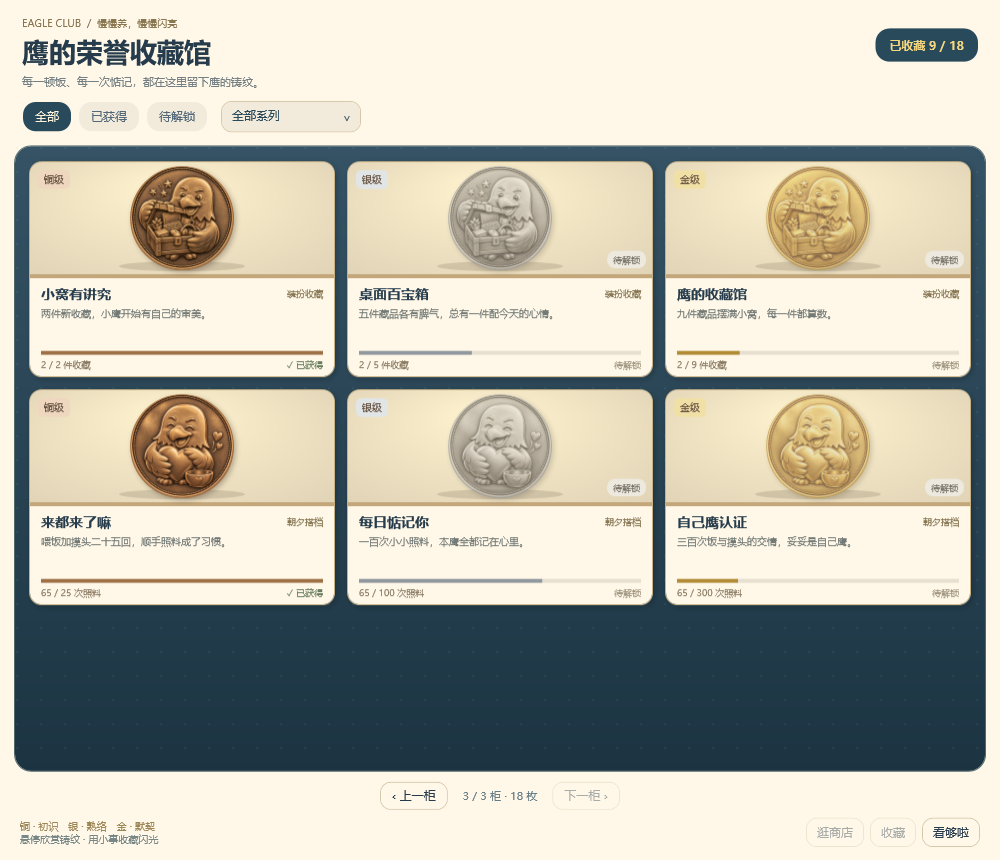

# v1.10.0 · 大头鹰摸鱼俱乐部

日期：2026-09-20。继承 v1.9 的 REQ-001～008 Demo 功能，本版重点是日常界面、小游戏节奏和荣誉扩充。

## 这次改了什么

- **猜拳小窗**：304 × 352 的独立小窗，图形拳型按钮、双方对战与结果提示。选拳后约 0.6 秒开始出招，取消两段额外站立等待；完整出拳与反应动作继续播放，公平揭晓、奖励冷却不变。一局演出约 5 秒，不含首次预载、思考和上一动作收尾。
- **鹰选好物**：正常窗口每页 4 × 2 个商品格，窄窗减少列数、矮窗减少行数。真实桌子、电脑、服装与动作缩略图，分类 / 收藏筛选、翻页、固定详情栏；预览保留，购买改为带价格与余额的确认小窗。
- **荣誉收藏馆**：从 9 枚增加到 18 枚，新增工作、收藏、相伴三个系列。每系列都有独立铜 / 银 / 金浮雕图，分别结合电脑和时钟、收藏箱、爱心与照料意象。分页陈列、系列和获得状态交叉筛选，已获徽章有轻微反光。
- **俱乐部面板**：日常陪伴 / 工位与钱包 / 消息与设置三页，加入小鹰会员工牌、饭搭子按钮和工资袋。
- **邮局与小剧场**：GitHub、AI 消息、接入设置统一邮递插画；独立预览增加票根、帷幕、舞台与脚灯。见 [邮局实际窗口](images/v1.10-github.png)。
- **界面轻过渡**：窗口 / 养成页约 180 ms，商店翻页约 140 ms。遵循 Windows 关闭动画和高对比设置；切换立即生效，不把动画当等待锁，也不替代角色逐帧动作。

## 新荣誉条件

| 系列 | 铜 | 银 | 金 |
| --- | --- | --- | --- |
| 工位值班 | 累计有效工作 30 分钟 | 5 小时 | 20 小时 |
| 装扮收藏 | 2 件非默认藏品 | 5 件 | 9 件 |
| 朝夕搭档 | 成功喂食与摸头合计 25 次 | 100 次 | 300 次 |

不把空挂时长当照料次数，不计算未知藏品；原有荣誉 ID 与关联奖励保留。已获得的荣誉写入成就记录，后续某个可选资源不可用不会倒扣荣誉。新增荣誉本身不额外发钱，避免改变经济平衡。

图中为隔离测试进度，未解锁的徽章会减淡显示。原始 PNG 保留完整金属色与透明外围。

## 升级

1. 从旧版右键菜单退出，解压新版到新目录。
2. 运行 `EagleDeskPet.exe`；不需要安装 .NET。不要双击可选的 `EagleDeskPet.Mcp.exe`。
3. 正常启动继续使用原有本机存档。开发验收只用新建隔离存档，没有迁移或覆盖你的真实进度。
4. 若使用 AI 自动提醒且更换了程序目录，在“一键接入 AI”中重新预览 / 应用路径；本次开发不会自动修改真实客户端配置。

完整源码、生成提示词和测试入口都保留在仓库。商店 / 邮局装饰和九枚新徽章使用 imagegen 原生生成；实际商品图标来自已安装资源，不是概念图冒充商品。见 [UI 资源提示词](../DuckDeskPet/Assets/Ui/GENERATION.md)、[邮局提示词](../DuckDeskPet/Assets/Ui/club-post-v1.prompt.md)、[新徽章提示词](../DuckDeskPet/Assets/Badges/v3-generation-prompts.json)。原角色商业授权仍需单独确认。

验证结果与限制见 [v1.10 验证记录](VALIDATION-v1.10.md)。本版没有新增联网商城、充值、强制签到，也没有承诺物理屏幕持续 60 FPS。
